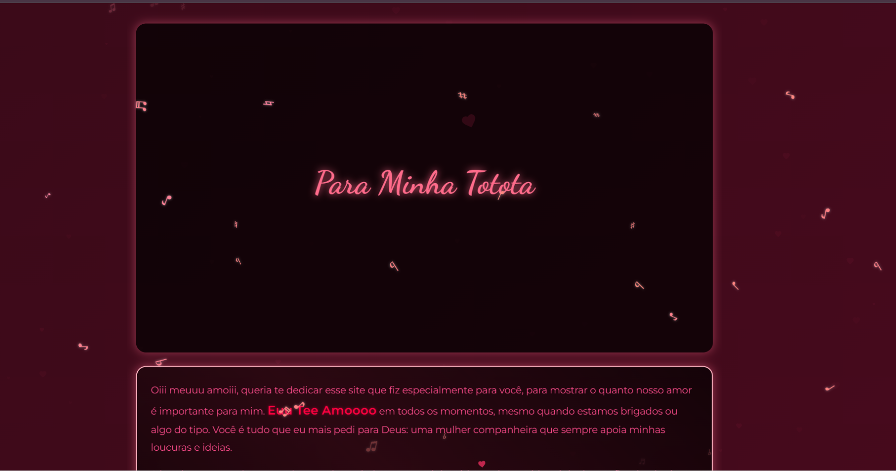

# Totota

Projeto web interativo desenvolvido como um projeto pessoal e personalizado.

## Preview



## Sobre o projeto

O Totota foi desenvolvido utilizando HTML e JavaScript, com a proposta de criar uma experiência personalizada através de imagens, música e elementos interativos.

## Tecnologias

- HTML5
- JavaScript

## Recursos

- Interface personalizada
- Imagens
- Música
- Elementos interativos
- Estrutura desenvolvida em HTML
- Arquivos de mídia organizados em pastas

## Objetivo

Projeto desenvolvido para praticar desenvolvimento web e JavaScript, explorando a criação de uma experiência interativa e personalizada.

## Acesso

[Visualizar projeto](https://joaodobaile011.github.io/totota/)

## Estrutura

```text
totota/
├── imagens/
├── música/
├── README.md
├── totota-github-preview.png
└── index.html
